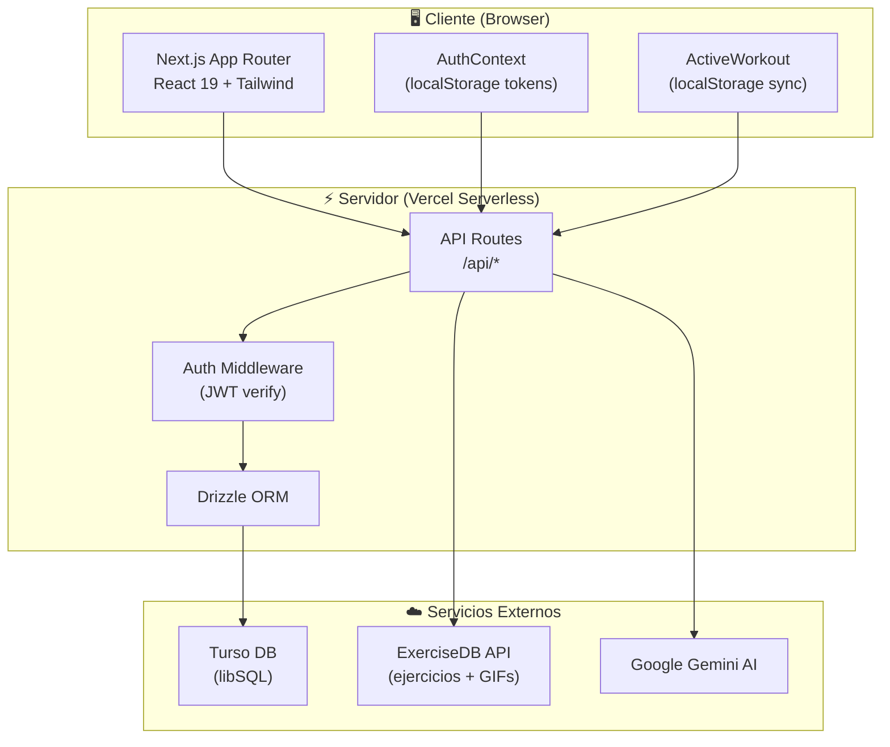
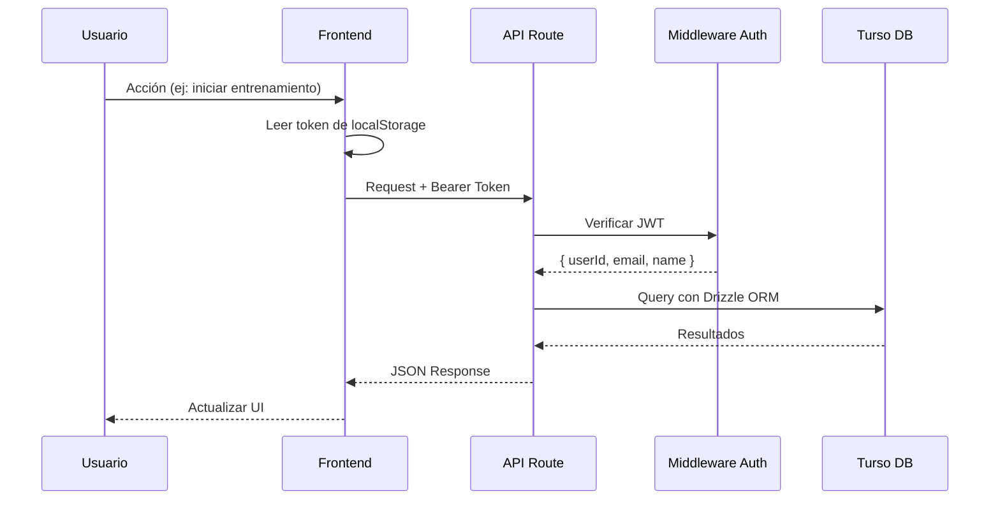
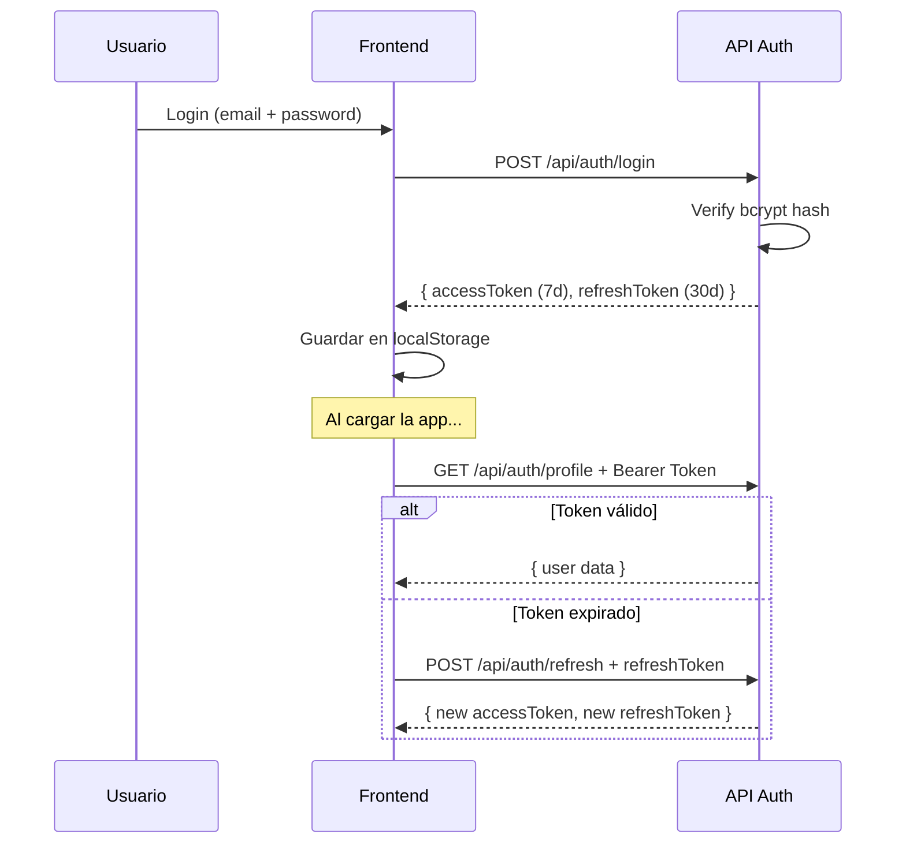
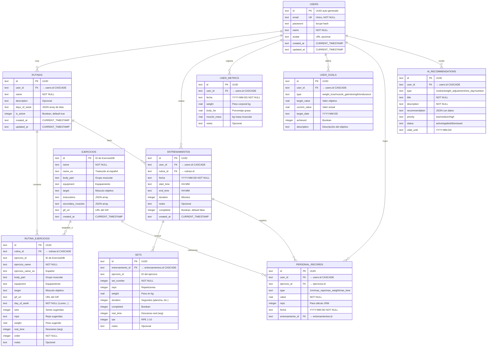
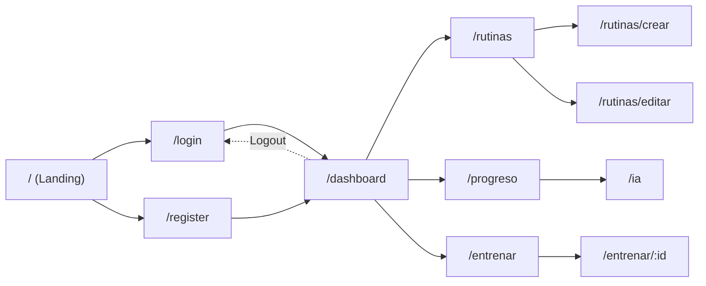

# 📖 GymLog — Documentación Completa

> **Versión:** 1.0.0  
> **Autor:** Christian Veneko  
> **Licencia:** MIT  
> **Última actualización:** Marzo 2026

---

## Tabla de Contenidos

1. [Descripción General](#1-descripción-general)
2. [Stack Tecnológico](#2-stack-tecnológico)
3. [Arquitectura del Sistema](#3-arquitectura-del-sistema)
4. [Modelo Entidad-Relación (MER)](#4-modelo-entidad-relación-mer)
5. [Esquema de Base de Datos](#5-esquema-de-base-de-datos)
6. [Estructura de Archivos](#6-estructura-de-archivos)
7. [Sistema de Autenticación](#7-sistema-de-autenticación)
8. [Referencia de API](#8-referencia-de-api)
9. [Vistas y Páginas](#9-vistas-y-páginas)
10. [Componentes](#10-componentes)
11. [Módulo de Inteligencia Artificial](#11-módulo-de-inteligencia-artificial)
12. [Manual de Usuario](#12-manual-de-usuario)
13. [Guía de Instalación y Despliegue](#13-guía-de-instalación-y-despliegue)
14. [Variables de Entorno](#14-variables-de-entorno)

---

## 1. Descripción General

**GymLog** es una aplicación web progresiva de seguimiento de entrenamientos de gimnasio con inteligencia artificial integrada. Permite a los usuarios crear rutinas personalizadas organizadas por días de la semana, registrar su progreso en tiempo real durante cada sesión de entrenamiento, y obtener análisis y recomendaciones personalizadas mediante Google Gemini AI.

### Funcionalidades Principales

| Módulo | Descripción |
|---|---|
| **Rutinas** | Crear, editar y gestionar rutinas de entrenamiento organizadas por días de la semana, con ejercicios de una base de datos de +1300 ejercicios |
| **Entrenamiento en vivo** | Registro en tiempo real de peso, repeticiones y notas por cada serie, con auto-guardado cada 10 segundos |
| **Progreso** | Calendario de rachas, estadísticas generales, historial de entrenamientos y detalle por sesión |
| **IA** | Análisis general, optimización de rutinas y consejos de recuperación generados por Gemini AI |
| **Autenticación** | Registro e inicio de sesión con JWT (access + refresh token) |

---

## 2. Stack Tecnológico

### Frontend

| Tecnología | Versión | Uso |
|---|---|---|
| Next.js | 15.x | Framework React con App Router, SSR y API Routes |
| React | 19.x | Librería de UI con componentes funcionales y hooks |
| TypeScript | 5.x | Tipado estático |
| Tailwind CSS | 3.x | Framework de utilidades CSS |
| Framer Motion | 12.x | Animaciones (instalado, uso limitado) |
| Recharts | 3.x | Gráficas (instalado, uso pendiente) |
| Heroicons | 2.x | Iconos SVG |
| React Hook Form | 7.x | Manejo de formularios (instalado) |
| Zod | 4.x | Validación de esquemas (instalado) |

### Backend

| Tecnología | Versión | Uso |
|---|---|---|
| Next.js API Routes | 15.x | Endpoints REST dentro de `src/app/api/` |
| Drizzle ORM | 0.44.x | ORM type-safe para SQLite/Turso |
| Turso (libSQL) | — | Base de datos SQLite distribuida en la nube |
| jose | 6.x | Firma y verificación de JWT (HS256) |
| bcryptjs | 3.x | Hash de contraseñas con salt (12 rounds) |
| Google Generative AI | 0.24.x | Integración con Gemini AI |

### Infraestructura

| Servicio | Uso |
|---|---|
| **Vercel** | Hosting y deploy del frontend + API serverless |
| **Turso** | Base de datos SQLite distribuida globalmente |
| **ExerciseDB API** | API externa con +1300 ejercicios con GIFs animados |
| **Google Gemini** | Motor de IA para análisis y recomendaciones |

---

## 3. Arquitectura del Sistema

### Diagrama de Arquitectura



### Flujo de Datos



### Patrón de Autenticación



---

## 4. Modelo Entidad-Relación (MER)



---

## 5. Esquema de Base de Datos

### Resumen de Tablas

| Tabla | Descripción | FK Principal |
|---|---|---|
| `users` | Usuarios registrados | — |
| `rutinas` | Plantillas de rutinas | `user_id → users` |
| `ejercicios` | Caché de ExerciseDB API | — |
| `rutina_ejercicios` | Relación rutina↔ejercicio por día | `rutina_id → rutinas` |
| `entrenamientos` | Sesiones de entrenamiento | `user_id → users`, `rutina_id → rutinas` |
| `sets` | Series individuales por sesión | `entrenamiento_id → entrenamientos` |
| `user_metrics` | Métricas corporales del usuario | `user_id → users` |
| `user_goals` | Objetivos del usuario | `user_id → users` |
| `personal_records` | Records personales | `user_id → users`, `ejercicio_id → ejercicios` |
| `ai_recommendations` | Recomendaciones de IA | `user_id → users` |

### Convenciones

- **IDs:** UUID v4 generados con `crypto.randomUUID()`
- **Fechas:** Texto en formato ISO (`YYYY-MM-DD` o `CURRENT_TIMESTAMP`)
- **Booleanos:** SQLite `integer` con mode `boolean` (0/1)
- **JSON:** Almacenado como texto (`JSON.stringify` / `JSON.parse`)
- **Cascadas:** `ON DELETE CASCADE` en relaciones padre-hijo

---

## 6. Estructura de Archivos

```
gymlog/
├── src/
│   ├── app/                              # Next.js App Router
│   │   ├── layout.tsx                    # Layout raíz con AuthProvider
│   │   ├── page.tsx                      # Landing page (home)
│   │   ├── globals.css                   # Estilos globales + Tailwind
│   │   │
│   │   ├── login/page.tsx                # Página de inicio de sesión
│   │   ├── register/page.tsx             # Página de registro
│   │   ├── dashboard/page.tsx            # Dashboard principal
│   │   ├── progreso/page.tsx             # Estadísticas y calendario
│   │   ├── ia/page.tsx                   # Análisis con Gemini AI
│   │   │
│   │   ├── rutinas/
│   │   │   ├── page.tsx                  # Lista de rutinas
│   │   │   ├── crear/page.tsx            # Crear nueva rutina
│   │   │   └── editar/page.tsx           # Editar rutina existente
│   │   │
│   │   ├── entrenar/
│   │   │   ├── page.tsx                  # Selección de rutina para entrenar
│   │   │   └── [id]/page.tsx             # Sesión de entrenamiento por rutina
│   │   │
│   │   └── api/                          # API REST (serverless)
│   │       ├── auth/
│   │       │   ├── login/route.ts        # POST: Login
│   │       │   ├── register/route.ts     # POST: Registro
│   │       │   ├── profile/route.ts      # GET/PUT: Perfil
│   │       │   └── refresh/route.ts      # POST: Renovar tokens
│   │       ├── rutinas/
│   │       │   ├── route.ts              # CRUD rutinas
│   │       │   └── [id]/route.ts         # Operaciones por ID
│   │       ├── entrenamientos/
│   │       │   ├── route.ts              # CRUD entrenamientos
│   │       │   ├── active/route.ts       # GET entrenamiento activo
│   │       │   └── [id]/
│   │       │       ├── route.ts          # PATCH entrenamiento
│   │       │       └── sets/route.ts     # PATCH sync de sets
│   │       ├── ejercicios/route.ts       # GET buscar ejercicios
│   │       ├── sets/route.ts             # Operaciones de sets
│   │       ├── stats/route.ts            # Estadísticas avanzadas
│   │       ├── ia/route.ts              # Análisis con Gemini AI
│   │       ├── progreso/route.ts         # Datos de progreso
│   │       └── users/route.ts            # Gestión de usuarios
│   │
│   ├── components/
│   │   ├── ActiveWorkout.tsx             # Widget de entrenamiento activo (754 líneas)
│   │   ├── WorkoutDetailModal.tsx        # Modal de detalles de sesión
│   │   ├── LazyGif.tsx                   # Componente de carga lazy para GIFs
│   │   └── ui/                           # Componentes UI reutilizables (vacío)
│   │
│   ├── lib/
│   │   ├── auth/
│   │   │   ├── AuthContext.tsx            # Context de React para autenticación
│   │   │   ├── jwt.ts                     # Creación y verificación de tokens JWT
│   │   │   ├── middleware.ts              # Middleware de autenticación para API
│   │   │   └── password.ts               # Hash, verificación y validación
│   │   ├── db/
│   │   │   ├── index.ts                   # Conexión a Turso con Drizzle ORM
│   │   │   └── schema.ts                 # Schema completo de la base de datos
│   │   └── utils/
│   │       └── dateUtils.ts               # Utilidades de fecha y zona horaria
│   │
│   └── types/                             # Tipos TypeScript adicionales
│
├── drizzle/                               # Migraciones de Drizzle
├── drizzle.config.ts                      # Configuración de Drizzle Kit
├── next.config.js                         # Configuración de Next.js
├── tailwind.config.js                     # Configuración de Tailwind CSS
├── tsconfig.json                          # Configuración de TypeScript
├── vercel.json                            # Configuración de despliegue en Vercel
├── package.json                           # Dependencias y scripts
└── .env.example                           # Plantilla de variables de entorno
```

---

## 7. Sistema de Autenticación

### Componentes

| Archivo | Responsabilidad |
|---|---|
| `lib/auth/password.ts` | Hash con bcrypt (12 salt rounds), validación de fortaleza (8+ chars, mayúscula, minúscula, número) |
| `lib/auth/jwt.ts` | Crear access token (7 días), refresh token (30 días), verificar y extraer payload |
| `lib/auth/middleware.ts` | `withAuth()` wrapper que verifica JWT y pasa `user` al handler |
| `lib/auth/AuthContext.tsx` | Context de React: estado del usuario, login, logout, auto-refresh de tokens |

### Flujo de Autenticación

1. **Registro:** `POST /api/auth/register` → valida email + password → hash bcrypt → crea usuario → genera tokens JWT
2. **Login:** `POST /api/auth/login` → busca usuario → verifica bcrypt → genera tokens JWT
3. **Perfil:** `GET /api/auth/profile` → middleware verifica token → retorna datos del usuario
4. **Refresh:** `POST /api/auth/refresh` → verifica refresh token → genera nuevos tokens
5. **Client-side:** `AuthContext` almacena tokens en `localStorage`, intenta refresh automático al cargar

### Protección de Rutas

- **API:** Todas las rutas (excepto login/register) usan `withAuth()` que verifica el header `Authorization: Bearer <token>`
- **Frontend:** El hook `useAuthGuard()` redirige a `/login` si no hay sesión activa

---

## 8. Referencia de API

Todas las respuestas siguen el formato:
```json
{
  "success": true|false,
  "data": { ... },
  "error": "mensaje de error (opcional)",
  "message": "mensaje informativo (opcional)"
}
```

### Autenticación

| Método | Endpoint | Auth | Descripción |
|---|---|---|---|
| `POST` | `/api/auth/register` | ❌ | Crear cuenta nueva |
| `POST` | `/api/auth/login` | ❌ | Iniciar sesión |
| `GET` | `/api/auth/profile` | ✅ | Obtener perfil del usuario |
| `PUT` | `/api/auth/profile` | ✅ | Actualizar nombre/avatar |
| `POST` | `/api/auth/refresh` | ❌ | Renovar tokens con refresh token |

#### POST `/api/auth/register`
```json
// Body
{ "name": "Christian", "email": "user@email.com", "password": "Pass1234" }

// Response 201
{
  "success": true,
  "data": {
    "user": { "id": "uuid", "name": "Christian", "email": "user@email.com" },
    "tokens": { "accessToken": "jwt...", "refreshToken": "jwt..." }
  }
}
```

#### POST `/api/auth/login`
```json
// Body
{ "email": "user@email.com", "password": "Pass1234" }

// Response 200
{
  "success": true,
  "data": {
    "user": { "id": "uuid", "name": "Christian", "email": "user@email.com", "avatar": null },
    "tokens": { "accessToken": "jwt...", "refreshToken": "jwt..." }
  }
}
```

---

### Rutinas

| Método | Endpoint | Auth | Descripción |
|---|---|---|---|
| `GET` | `/api/rutinas` | ✅ | Listar rutinas del usuario |
| `POST` | `/api/rutinas` | ✅ | Crear nueva rutina con ejercicios |
| `PUT` | `/api/rutinas` | ✅ | Actualizar rutina (body incluye `id`) |
| `DELETE` | `/api/rutinas?id=xxx` | ✅ | Eliminar rutina (cascade a ejercicios) |

**Query params de GET:**
- `active=true|false` — Filtrar por estado
- `include_ejercicios=true|false` — Incluir ejercicios detallados (default: true)

#### POST `/api/rutinas`
```json
// Body
{
  "name": "Push Pull Legs",
  "description": "Rutina de 6 días",
  "daysOfWeek": ["Lunes", "Martes", "Miércoles"],
  "isActive": true,
  "ejercicios": [
    {
      "ejercicioId": "0001",
      "ejercicioName": "bench press",
      "ejercicioNameEs": "Press de banca",
      "bodyPart": "chest",
      "equipment": "barbell",
      "target": "pectorals",
      "gifUrl": "https://...",
      "dayOfWeek": "Lunes",
      "sets": 4,
      "order": 1
    }
  ]
}
```

---

### Entrenamientos

| Método | Endpoint | Auth | Descripción |
|---|---|---|---|
| `GET` | `/api/entrenamientos` | ✅ | Listar entrenamientos con sets |
| `POST` | `/api/entrenamientos` | ✅ | Crear nueva sesión de entrenamiento |
| `PUT` | `/api/entrenamientos` | ✅ | Actualizar sesión (body incluye `id`) |
| `DELETE` | `/api/entrenamientos?id=xxx` | ✅ | Eliminar entrenamiento (cascade a sets) |
| `GET` | `/api/entrenamientos/active?fecha=YYYY-MM-DD` | ✅ | Obtener entrenamiento activo del día |
| `PATCH` | `/api/entrenamientos/[id]` | ✅ | Completar/actualizar entrenamiento |
| `PATCH` | `/api/entrenamientos/[id]/sets` | ✅ | Sincronizar sets del entrenamiento |

**Query params de GET:**
- `fecha=YYYY-MM-DD` — Filtrar por fecha
- `rutinaId=xxx` — Filtrar por rutina
- `limit=N` — Límite de resultados (default: 50)
- `include_stats=true` — Incluir estadísticas calculadas

---

### Estadísticas

| Método | Endpoint | Auth | Descripción |
|---|---|---|---|
| `GET` | `/api/stats?type=overview` | ✅ | Resumen general (total workouts, racha, peso máximo, sets) |
| `GET` | `/api/stats?type=progress` | ✅ | Progreso por ejercicio (peso y reps máximos) |
| `GET` | `/api/stats?type=volume` | ✅ | Volumen por día y grupo muscular |
| `GET` | `/api/stats?type=frequency` | ✅ | Frecuencia por día de semana y ejercicio |
| `GET` | `/api/stats?type=personal_records` | ✅ | Records personales |
| `GET` | `/api/stats?type=body_metrics` | ✅ | Métricas corporales |

**Query params adicionales:**
- `start_date=YYYY-MM-DD` — Fecha inicio del rango
- `end_date=YYYY-MM-DD` — Fecha fin del rango
- `ejercicio_id=xxx` — Filtrar por ejercicio específico

---

### Ejercicios

| Método | Endpoint | Auth | Descripción |
|---|---|---|---|
| `GET` | `/api/ejercicios` | ✅ | Buscar ejercicios con paginación |

**Query params:**
- `search=texto` — Búsqueda por nombre (mín. 2 caracteres)
- `bodyPart=chest|back|shoulders|...` — Filtrar por grupo muscular
- `limit=N` — Resultados por página (default: 30)
- `offset=N` — Desplazamiento para paginación

---

### Inteligencia Artificial

| Método | Endpoint | Auth | Descripción |
|---|---|---|---|
| `GET` | `/api/ia` | ✅ | Listar tipos de análisis disponibles |
| `POST` | `/api/ia` | ✅ | Solicitar análisis de IA |

#### POST `/api/ia`
```json
// Body
{
  "type": "routine_review",  // routine_review | progress_analysis | workout_suggestions | form_feedback
  "data": {
    "name": "Mi Rutina",
    "description": "Rutina PPL",
    "daysOfWeek": "Lunes, Miércoles, Viernes",
    "ejercicios": [...]
  }
}

// Response 200
{
  "success": true,
  "data": {
    "type": "routine_review",
    "analysis": "Texto del análisis generado por Gemini...",
    "timestamp": "2026-03-11T00:00:00.000Z",
    "userId": "uuid"
  }
}
```

---

## 9. Vistas y Páginas

### Mapa de Navegación



### Detalle de Páginas

| Ruta | Componente | Auth | Descripción |
|---|---|---|---|
| `/` | `HomePage` | ❌ | Landing page con CTA de registro/login. Redirige a dashboard si hay token |
| `/login` | `LoginPage` | ❌ | Formulario de email + password. Redirige si ya está autenticado |
| `/register` | `RegisterPage` | ❌ | Formulario de nombre + email + password con validación en tiempo real |
| `/dashboard` | `DashboardPage` | ✅ | Panel principal: acciones rápidas, widget de entrenamiento activo, resumen general, actividad reciente |
| `/rutinas` | `RutinasPage` | ✅ | Lista de rutinas con contador de ejercicios y sets totales |
| `/rutinas/crear` | `CrearRutinaPage` | ✅ | Formulario completo: selección de días, búsqueda de ejercicios con infinite scroll, configuración de series |
| `/rutinas/editar` | `EditarRutinaPage` | ✅ | Edición de rutina existente con los mismos controles de creación |
| `/entrenar` | `EntrenarPage` | ✅ | Selección de rutina para iniciar sesión de entrenamiento |
| `/entrenar/:id` | `EntrenarIdPage` | ✅ | Sesión de entrenamiento específica |
| `/progreso` | `ProgresoPage` | ✅ | Calendario de rachas, estadísticas, historial con modal de detalles |
| `/ia` | `IAPage` | ✅ | Tres tipos de análisis con Gemini AI: general, optimización, recuperación |

---

## 10. Componentes

### ActiveWorkout (`components/ActiveWorkout.tsx`)

Componente principal del entrenamiento en vivo. **754 líneas**.

**Funcionalidades:**
- Selección de rutina para iniciar entrenamiento
- Registro de peso, repeticiones, notas y "fallo muscular" por cada serie
- Layout responsivo: tarjetas verticales en móvil, tabla horizontal en desktop
- Auto-sincronización con el servidor cada 10 segundos
- Persistencia local en `localStorage` para evitar pérdida de datos
- Modal de finalización con duración manual
- Evento `workoutFinished` para refrescar el dashboard

**Estado:**
```typescript
activeWorkout: ActiveWorkout | null    // Entrenamiento activo
localSets: SetData[]                   // Sets en memoria local
syncing: boolean                       // Indicador de sincronización
finishing: boolean                     // Indicador de finalización
rutinas: any[]                         // Rutinas disponibles
showRutinaSelector: boolean            // Mostrar selector
showFinishDialog: boolean              // Mostrar modal de fin
manualDuration: number                 // Duración manual (minutos)
```

### WorkoutDetailModal (`components/WorkoutDetailModal.tsx`)

Modal que muestra los detalles completos de una sesión de entrenamiento pasada, incluyendo todos los sets con peso, reps y notas.

### LazyGif (`components/LazyGif.tsx`)

Componente wrapper para cargar GIFs de ejercicios de forma lazy con `IntersectionObserver`, mostrando un placeholder mientras carga.

---

## 11. Módulo de Inteligencia Artificial

### Motor

- **API:** Google Generative AI (Gemini)
- **Modelo:** `gemini-pro` (⚠️ deprecado, debería ser `gemini-1.5-flash`)

### Tipos de Análisis

| Tipo | Prompt | Datos Requeridos |
|---|---|---|
| `routine_review` | Evaluación de balance muscular, volumen, progresión y modificaciones | Rutina con ejercicios |
| `progress_analysis` | Evaluación de fortalezas, áreas de mejora y metas realistas | Historial de entrenamientos |
| `workout_suggestions` | 3 rutinas personalizadas con ejercicios y series | Objetivos, experiencia, tiempo, equipamiento |
| `form_feedback` | Técnica correcta, errores comunes y variaciones | Ejercicio específico |

### Flujo

1. El frontend envía `POST /api/ia` con `{ type, data }`
2. El backend construye un prompt contextualizado en español
3. Se envía a Gemini con instrucción de responder en español
4. La respuesta de texto se retorna directamente al frontend
5. Se renderiza con `whitespace-pre-wrap` para preservar el formato

---

## 12. Manual de Usuario

### 12.1 Registro e Inicio de Sesión

1. Abre la aplicación en tu navegador
2. Haz clic en **"Crear Cuenta Gratis"** en la página principal
3. Completa el formulario:
   - **Nombre completo**
   - **Email** (debe ser válido y único)
   - **Contraseña** (mínimo 8 caracteres, 1 mayúscula, 1 minúscula, 1 número)
   - **Confirmar contraseña**
4. Haz clic en **"Crear Cuenta"**
5. Serás redirigido automáticamente al dashboard

Para iniciar sesión en futuras visitas, usa **"Iniciar Sesión"** con tu email y contraseña.

### 12.2 Crear una Rutina

1. Desde el dashboard, haz clic en **"Crear Rutina"** (tarjeta azul)
2. Ingresa el **nombre** de la rutina (ej: "Push Pull Legs")
3. Opcionalmente, añade una **descripción**
4. Selecciona los **días de la semana** en que entrenas
5. Para cada día seleccionado:
   - Haz clic en **"Agregar Ejercicio"**
   - **Busca** por nombre o **filtra** por grupo muscular
   - Haz clic en el ejercicio deseado
   - Configura el **número de series**
   - Confirma con **"Agregar"**
6. Puedes **reordenar** ejercicios con las flechas ↑↓ o **eliminar** con 🗑️
7. Haz clic en **"Crear Rutina"** para guardar

### 12.3 Entrenar

1. En el dashboard, la sección **"Entrenamiento de Hoy"** muestra tus rutinas disponibles
2. Haz clic en la rutina que quieres entrenar → se inicia la sesión
3. Para cada ejercicio verás las series configuradas:
   - Ingresa el **peso (kg)** usado
   - Ingresa las **repeticiones** realizadas
   - Marca **"Fallo"** si llegaste al fallo muscular
   - Agrega **notas** opcionales
   - Marca la serie como **completada** (✓)
4. Los datos se guardan automáticamente cada 10 segundos
5. Al terminar, haz clic en **"✅ Finalizar"**
6. Ingresa la **duración** del entrenamiento en minutos
7. Haz clic en **"Guardar y Finalizar"**

### 12.4 Ver Progreso

1. Desde el dashboard, haz clic en **"Progreso"** (tarjeta naranja)
2. Verás:
   - **Estadísticas generales:** entrenamientos totales, racha actual, sets completados, peso máximo
   - **Calendario de rachas:** los días verdes indican entrenamiento completado. Haz clic en un día verde para ver los detalles
   - **Historial de entrenamientos:** lista cronológica con duración, sets y estado
3. Haz clic en cualquier entrenamiento para ver el **detalle completo** (sets, pesos, reps)

### 12.5 Análisis con IA

1. Desde el dashboard o la página de progreso, navega a **"Análisis IA"**
2. Selecciona un tipo de análisis:
   - **📊 Análisis General:** evaluación completa de tu progreso
   - **💪 Optimización de Rutina:** recomendaciones para mejorar tu rutina
   - **🔄 Recuperación:** consejos de descanso y recuperación
3. Espera mientras la IA genera el análisis (puede tomar unos segundos)
4. Lee las recomendaciones personalizadas

### 12.6 Gestionar Rutinas

1. Desde el dashboard, haz clic en **"Mis Rutinas"** (tarjeta púrpura)
2. Verás la lista de todas tus rutinas con:
   - Nombre y descripción
   - Días de entrenamiento
   - Conteo de ejercicios y sets totales
   - Estado (activa/inactiva)
3. Puedes **editar** o **eliminar** rutinas desde esta vista

---

## 13. Guía de Instalación y Despliegue

### Requisitos Previos

- Node.js 18+ y npm
- Cuenta en [Turso](https://turso.tech/) (base de datos)
- API Key de [Google Gemini](https://aistudio.google.com/)
- Cuenta en [Vercel](https://vercel.com/) (para despliegue)

### Instalación Local

```bash
# 1. Clonar el repositorio
git clone https://github.com/ChristianVeneko/Gymlog.git
cd Gymlog

# 2. Instalar dependencias
npm install

# 3. Configurar variables de entorno
cp .env.example .env.local
# Editar .env.local con tus credenciales

# 4. Crear la base de datos en Turso
turso db create gymlog
turso db show gymlog  # Copiar URL
turso db tokens create gymlog  # Copiar token

# 5. Ejecutar migraciones
npm run db:push

# 6. Iniciar el servidor de desarrollo
npm run dev
```

La aplicación estará disponible en `http://localhost:3000`

### Scripts Disponibles

| Script | Comando | Descripción |
|---|---|---|
| `dev` | `npm run dev` | Servidor de desarrollo con hot-reload |
| `build` | `npm run build` | Compilar para producción |
| `start` | `npm run start` | Iniciar servidor de producción |
| `lint` | `npm run lint` | Ejecutar ESLint |
| `type-check` | `npm run type-check` | Verificar tipos TypeScript |
| `db:generate` | `npm run db:generate` | Generar migraciones de Drizzle |
| `db:migrate` | `npm run db:migrate` | Ejecutar migraciones |
| `db:push` | `npm run db:push` | Sincronizar schema directamente |
| `db:studio` | `npm run db:studio` | Abrir Drizzle Studio (GUI de DB) |

### Despliegue en Vercel

1. Conecta el repositorio de GitHub a Vercel
2. En la configuración del proyecto, agrega las variables de entorno:
   - `DATABASE_URL`
   - `DATABASE_AUTH_TOKEN`
   - `JWT_SECRET`
   - `GEMINI_API_KEY`
   - `EXERCISEDB_API_URL`
3. Deploy automático en cada push a `main`

---

## 14. Variables de Entorno

| Variable | Requerida | Descripción | Ejemplo |
|---|---|---|---|
| `DATABASE_URL` | ✅ | URL de Turso | `libsql://gymlog-user.turso.io` |
| `DATABASE_AUTH_TOKEN` | ✅ | Token de autenticación de Turso | `eyJhbG...` |
| `JWT_SECRET` | ✅ | Clave secreta para firmar JWT | Generar con `openssl rand -base64 32` |
| `GEMINI_API_KEY` | ✅ | API Key de Google Gemini | `AIza...` |
| `EXERCISEDB_API_URL` | ✅ | URL de ExerciseDB API | `https://exercisedb-api-one.vercel.app` |
| `NEXTAUTH_URL` | ⚙️ | URL base de la app | `http://localhost:3000` o `https://tu-app.vercel.app` |
| `NODE_ENV` | ⚙️ | Entorno de ejecución | `development` o `production` |

---

> **GymLog** — Tu compañero inteligente para el fitness 🏋️‍♂️
